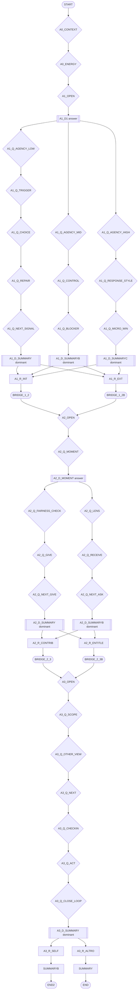

```mermaid
flowchart TD
  START([START]) --> A0_CONTEXT{A0_CONTEXT}
  A0_CONTEXT --> A0_ENERGY{A0_ENERGY}
  A0_ENERGY --> A1_OPEN{A1_OPEN}

  A1_OPEN --> A1_D1[[A1_D1 answer]]
  A1_D1 --> A1_Q_AGENCY_HIGH{A1_Q_AGENCY_HIGH}
  A1_D1 --> A1_Q_AGENCY_MID{A1_Q_AGENCY_MID}
  A1_D1 --> A1_Q_AGENCY_LOW{A1_Q_AGENCY_LOW}

  A1_Q_AGENCY_HIGH --> A1_Q_RESPONSE_STYLE{A1_Q_RESPONSE_STYLE}
  A1_Q_RESPONSE_STYLE --> A1_Q_MICRO_WIN{A1_Q_MICRO_WIN}
  A1_Q_MICRO_WIN --> A1_D_SUMMARYC[[A1_D_SUMMARYC dominant]]

  A1_Q_AGENCY_MID --> A1_Q_CONTROL{A1_Q_CONTROL}
  A1_Q_CONTROL --> A1_Q_BLOCKER{A1_Q_BLOCKER}
  A1_Q_BLOCKER --> A1_D_SUMMARYB[[A1_D_SUMMARYB dominant]]

  A1_Q_AGENCY_LOW --> A1_Q_TRIGGER{A1_Q_TRIGGER}
  A1_Q_TRIGGER --> A1_Q_CHOICE{A1_Q_CHOICE}
  A1_Q_CHOICE --> A1_Q_REPAIR{A1_Q_REPAIR}
  A1_Q_REPAIR --> A1_Q_NEXT_SIGNAL{A1_Q_NEXT_SIGNAL}
  A1_Q_NEXT_SIGNAL --> A1_D_SUMMARY[[A1_D_SUMMARY dominant]]

  A1_D_SUMMARY --> A1_R_INT[A1_R_INT]
  A1_D_SUMMARY --> A1_R_EXT[A1_R_EXT]
  A1_D_SUMMARYB --> A1_R_INT
  A1_D_SUMMARYB --> A1_R_EXT
  A1_D_SUMMARYC --> A1_R_INT
  A1_D_SUMMARYC --> A1_R_EXT
  A1_R_INT --> BRIDGE_1_2([BRIDGE_1_2])
  A1_R_EXT --> BRIDGE_1_2B([BRIDGE_1_2B])

  BRIDGE_1_2 --> A2_OPEN{A2_OPEN}
  BRIDGE_1_2B --> A2_OPEN
  A2_OPEN --> A2_Q_MOMENT{A2_Q_MOMENT}
  A2_Q_MOMENT --> A2_D_MOMENT[[A2_D_MOMENT answer]]
  A2_D_MOMENT --> A2_Q_FAIRNESS_CHECK{A2_Q_FAIRNESS_CHECK}
  A2_D_MOMENT --> A2_Q_LENS{A2_Q_LENS}

  A2_Q_FAIRNESS_CHECK --> A2_Q_GIVE{A2_Q_GIVE}
  A2_Q_GIVE --> A2_Q_NEXT_GIVE{A2_Q_NEXT_GIVE}
  A2_Q_NEXT_GIVE --> A2_D_SUMMARY[[A2_D_SUMMARY dominant]]

  A2_Q_LENS --> A2_Q_RECEIVE{A2_Q_RECEIVE}
  A2_Q_RECEIVE --> A2_Q_NEXT_ASK{A2_Q_NEXT_ASK}
  A2_Q_NEXT_ASK --> A2_D_SUMMARYB[[A2_D_SUMMARYB dominant]]

  A2_D_SUMMARY --> A2_R_CONTRIB[A2_R_CONTRIB]
  A2_D_SUMMARY --> A2_R_ENTITLE[A2_R_ENTITLE]
  A2_D_SUMMARYB --> A2_R_CONTRIB
  A2_D_SUMMARYB --> A2_R_ENTITLE
  A2_R_CONTRIB --> BRIDGE_2_3([BRIDGE_2_3])
  A2_R_ENTITLE --> BRIDGE_2_3B([BRIDGE_2_3B])

  BRIDGE_2_3 --> A3_OPEN{A3_OPEN}
  BRIDGE_2_3B --> A3_OPEN
  A3_OPEN --> A3_Q_SCOPE{A3_Q_SCOPE}
  A3_Q_SCOPE --> A3_Q_OTHER_VIEW{A3_Q_OTHER_VIEW}
  A3_Q_OTHER_VIEW --> A3_Q_NEXT{A3_Q_NEXT}
  A3_Q_NEXT --> A3_Q_CHECKIN{A3_Q_CHECKIN}
  A3_Q_CHECKIN --> A3_Q_ACT{A3_Q_ACT}
  A3_Q_ACT --> A3_Q_CLOSE_LOOP{A3_Q_CLOSE_LOOP}
  A3_Q_CLOSE_LOOP --> A3_D_SUMMARY[[A3_D_SUMMARY dominant]]

  A3_D_SUMMARY --> A3_R_SELF[A3_R_SELF]
  A3_D_SUMMARY --> A3_R_ALTRO[A3_R_ALTRO]
  A3_R_SELF --> SUMMARYB[SUMMARYB]
  A3_R_ALTRO --> SUMMARY[SUMMARY]
  SUMMARY --> END([END])
  SUMMARYB --> END2([END2])
```

