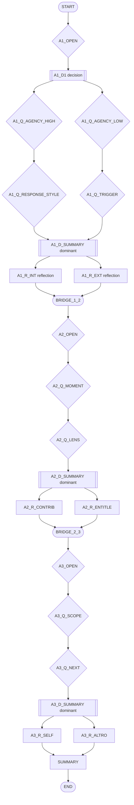

```mermaid
flowchart TD
  START([START]) --> A1_OPEN{A1_OPEN}
  A1_OPEN --> A1_D1[[A1_D1 decision]]
  A1_D1 --> A1_Q_AGENCY_HIGH{A1_Q_AGENCY_HIGH}
  A1_D1 --> A1_Q_AGENCY_LOW{A1_Q_AGENCY_LOW}

  A1_Q_AGENCY_HIGH --> A1_Q_RESPONSE_STYLE{A1_Q_RESPONSE_STYLE}
  A1_Q_AGENCY_LOW --> A1_Q_TRIGGER{A1_Q_TRIGGER}

  A1_Q_RESPONSE_STYLE --> A1_D_SUMMARY[[A1_D_SUMMARY dominant]]
  A1_Q_TRIGGER --> A1_D_SUMMARY

  A1_D_SUMMARY --> A1_R_INT[A1_R_INT reflection]
  A1_D_SUMMARY --> A1_R_EXT[A1_R_EXT reflection]

  A1_R_INT --> BRIDGE_1_2([BRIDGE_1_2])
  A1_R_EXT --> BRIDGE_1_2
  BRIDGE_1_2 --> A2_OPEN{A2_OPEN}

  A2_OPEN --> A2_Q_MOMENT{A2_Q_MOMENT}
  A2_Q_MOMENT --> A2_Q_LENS{A2_Q_LENS}
  A2_Q_LENS --> A2_D_SUMMARY[[A2_D_SUMMARY dominant]]
  A2_D_SUMMARY --> A2_R_CONTRIB[A2_R_CONTRIB]
  A2_D_SUMMARY --> A2_R_ENTITLE[A2_R_ENTITLE]

  A2_R_CONTRIB --> BRIDGE_2_3([BRIDGE_2_3])
  A2_R_ENTITLE --> BRIDGE_2_3
  BRIDGE_2_3 --> A3_OPEN{A3_OPEN}

  A3_OPEN --> A3_Q_SCOPE{A3_Q_SCOPE}
  A3_Q_SCOPE --> A3_Q_NEXT{A3_Q_NEXT}
  A3_Q_NEXT --> A3_D_SUMMARY[[A3_D_SUMMARY dominant]]

  A3_D_SUMMARY --> A3_R_SELF[A3_R_SELF]
  A3_D_SUMMARY --> A3_R_ALTRO[A3_R_ALTRO]

  A3_R_SELF --> SUMMARY[SUMMARY]
  A3_R_ALTRO --> SUMMARY
  SUMMARY --> END([END])
```
